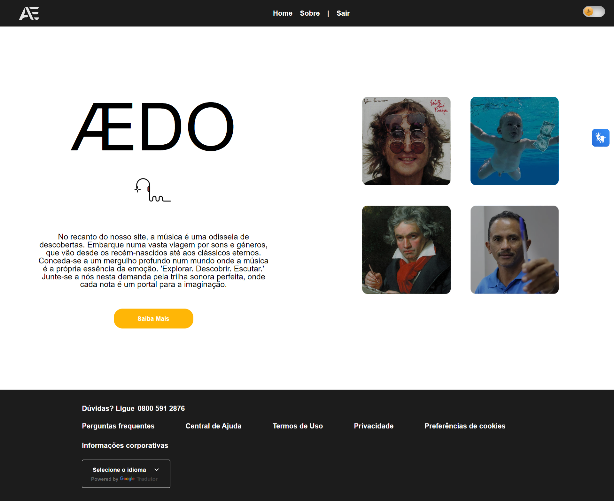

<h1 align="center"> - Aedo Music - </h1>

Em caracter de estudo e aprimoramentos da máteria de frontEnd, elaborei um exemplo de uma página com o tema Mario Bros.
 

  <a href="#-tecnologias">Tecnologias</a>&nbsp;&nbsp;&nbsp;|&nbsp;&nbsp;&nbsp;
  <a href="#-projeto">Projeto</a>&nbsp;&nbsp;&nbsp;|&nbsp;&nbsp;&nbsp;
  <a href="#-layout">Layout</a>&nbsp;&nbsp;&nbsp;|&nbsp;&nbsp;&nbsp;
  <a href="#memo-licença">Licença</a>

  

 

  

## 🚀 Tecnologias

Esse projeto foi desenvolvido com as seguintes tecnologias:

- VLibras
- HTML e CSS
- JavaScript && Propriedades (localStorage)
- Git e Github
- IonIcons
- Google Fonts
- Google Analytics
- Google Tag Manager
- Google Translate
- Google Ads (pixel remarketing)
- Microsoft Clarity
- Hotjar
- Render
- Facebook (pixel)

## 💻 Projeto

O projeto Aedo foi elaborado em caracter de um trabalho final da matéria de Front-end no Serratec.

## 🔖 Layout

Você pode visualizar o layout do projeto através [DESSE LINK](https://github.com/jeffersonmoraesjunior).

## :memo: Licença

Esse projeto está sob a licença MIT.

---

Feito com ♥ by 
<a href="https://github.com/jeffersonmoraesjunior">Jefferson Moraes</a> | | 
<a href="https://github.com/Nimai360">Nimai Marchiori</a> | |
<a href="https://github.com/gguedes00">Gabriel Guedes</a>  | | 
<a href="https://github.com/SteffanyRodrigues">Sthefanny Rodrigues</a>  | | 
<a href="https://github.com/naju15">Ana Julya</a> !